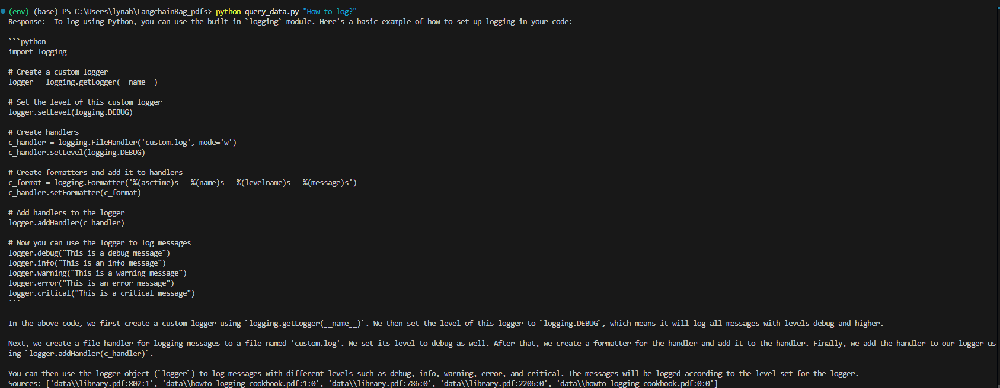

# RAG System with Ollama - Python Documentation Retrieval

This project implements a Retrieval-Augmented Generation (RAG) system that leverages **Ollama** for answering questions based on Python documentation. The system fetches relevant documentation chunks from a database, retrieves them, and generates an accurate response by leveraging both retrieval and generative capabilities.

## Overview

This project aims to help users retrieve information and documentation from Python's official documentation and answer questions related to Python libraries, modules, or code practices using a retrieval-augmented approach.

### Key Features:

-  **RAG (Retrieval-Augmented Generation)**: Combines document retrieval and language generation to provide more accurate and context-aware answers.

-  **Ollama Local API**: Uses the Ollama API locally to query and retrieve documentation, allowing questions to be answered based on specific pieces of information extracted from Python docs.

-  **Python Docs-based Knowledge**: The system is specifically designed to interact with Python’s official documentation.

-  **Chroma Database**: Chroma is used to persist and query chunks of Python documentation.

# RAG System with LangChain, Chroma, and Ollama

This project implements a **Retrieval-Augmented Generation (RAG)** system using **LangChain**, **Chroma**, and **Ollama** for local document-based question answering. It uses document chunks stored in Chroma's vector database and generates answers based on the retrieved context using the Ollama model.

## Requirements

To get started, you'll need to install the necessary Python libraries. You can install the required packages with the following:

```bash
pip  install  langchain-community  langchain-chroma  langchain-ollama
```

## Requirements

-  Required  libraries:

-  `langchain_community`
-  `langchain-chroma` 
-  `langchain-ollama`

## Setup Instructions
 
### 1. Clone the repository:

```bash
git clone https://github.com/lynah2/Python-Documentation-Query-System-with-RAG.git
cd Python-Documentation-Query-System-with-RAG

```

### 2. Install dependencies:
```bash
python -m venv env
source env/bin/activate  # macOS/Linux
.\env\Scripts\activate   # Windows
```

### 3. Download models:
```bash
ollama pull mistral  # Replace with the model you want to use
```

### 4. Prepare Chroma Database:
```bash
python populate_database.py
```

## Usage

To query the system, run the following command:
```bash
python query_system.py
```

Example:

